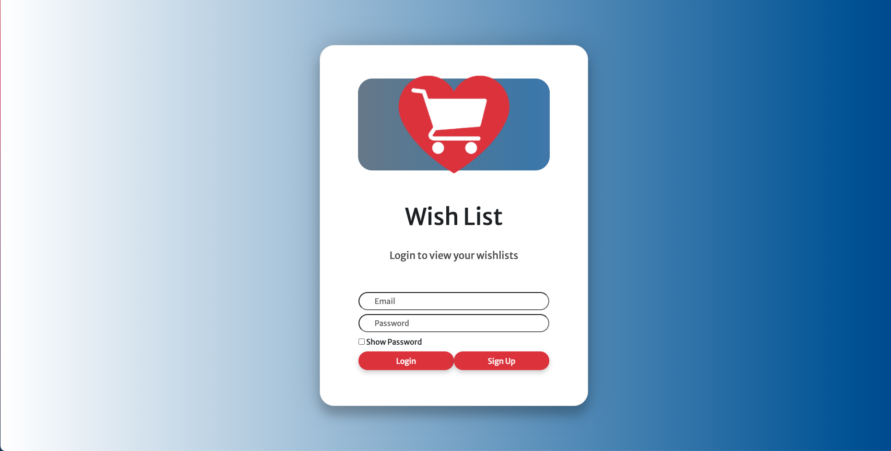
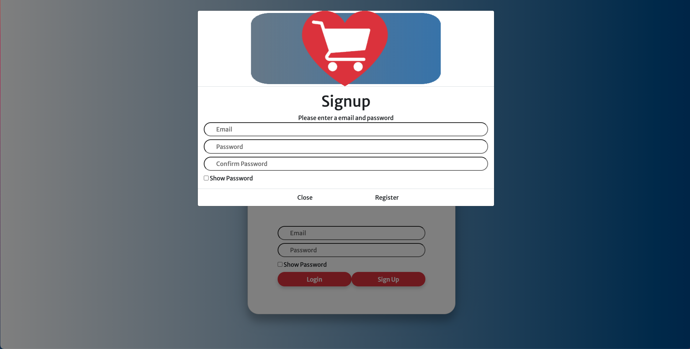
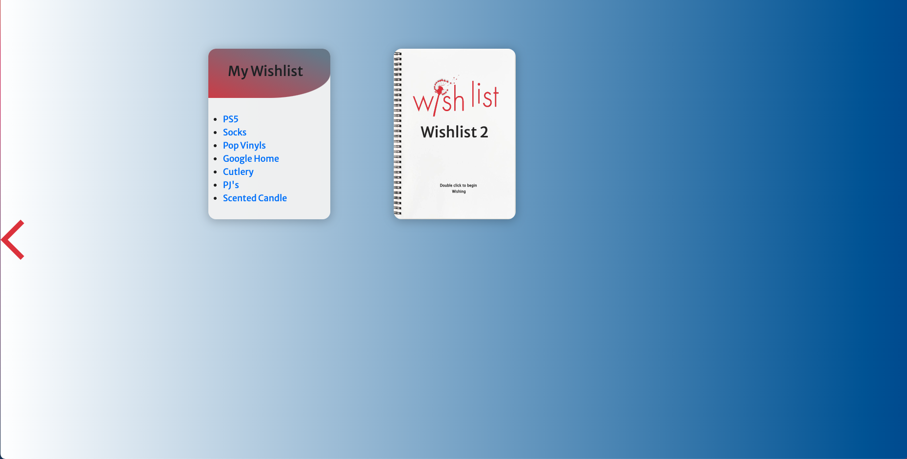

# Wishlist App

## Table of Contents
* [Description](#description)

* [Deployed App](#deployed-app)

* [Installation](#installation)

* [Usage](#usage)

* [Project Contributors](#project-contributors)

* [Screenshots](#screenshots)

## Description
The wishlist app allows the user to sign up for  an account and create as many wishlists as they'd like- which are saved to a database. They can then view their wishlists in the future by logging back in. When the wishlists are viewed, the items become links to Amazon that display search results for said item.

## Deployed App
https://festive-wish-list.herokuapp.com/

## Installation
npm install

## Usage
Sign up/log in, enter a wishlist title and items, click "Save Wishlist", click "View Wishlist"

## Project Contributors
Matthew Harvey (https://github.com/Mathew-Harvey), Leon Li (https://github.com/GrandBearSleepy) & Graham Elphick (https://github.com/grahamelphick)

## Screenshots

